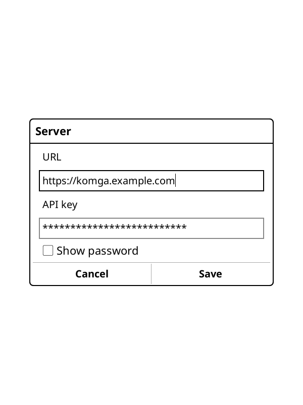
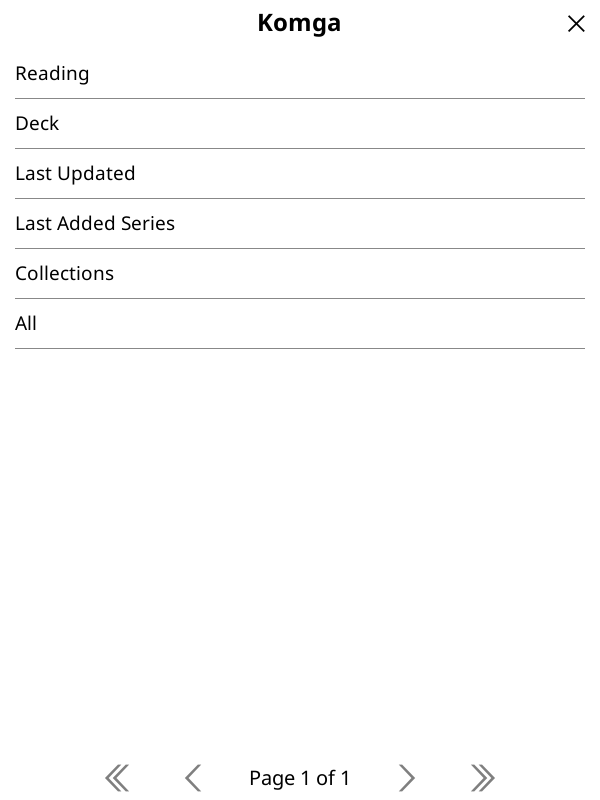
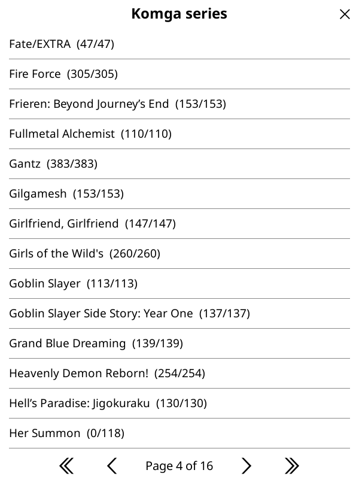
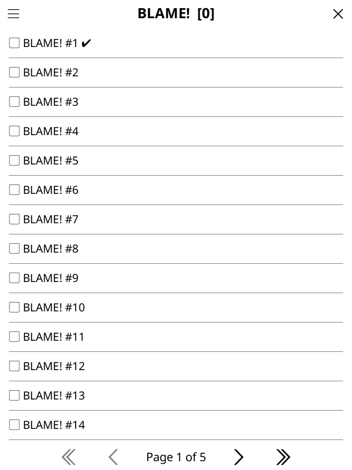
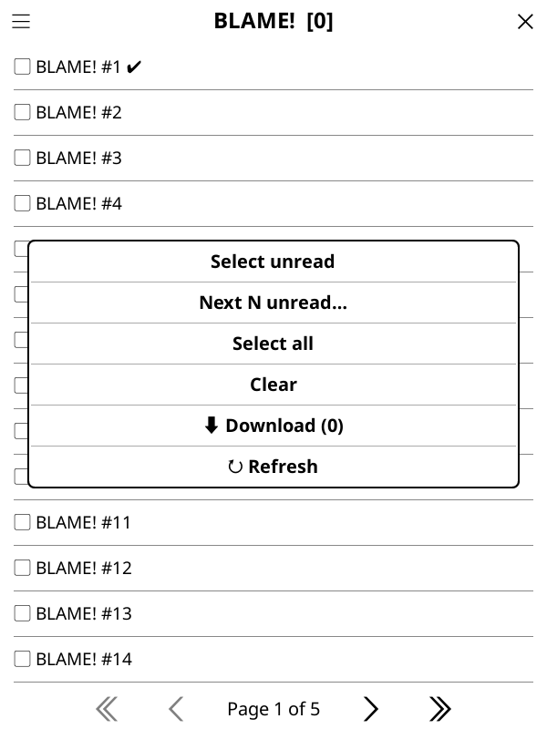

# Get Started

This walkthrough takes you from zero to downloading your first chapters.

## 1. Install the plugin

1. Download `komga.koplugin-vYYYY.MM.DD.zip` from the
   [Releases page](https://github.com/akamuraasai/koreader-komga/releases).
2. Extract the `komga.koplugin/` folder into KOReader's plugins directory:
    - **Kobo:** `.adds/koreader/plugins/komga.koplugin/`
    - **Other devices:** `<KOReader data dir>/plugins/komga.koplugin/`
3. Restart KOReader.

## 2. Create a Komga API key

In Komga, open **Account Settings → API Keys** and create a key (or call
`POST /api/v2/users/me/api-keys`). Copy it — you'll paste it in the next step.

## 3. Configure the server

Open the top menu → **Komga → Settings** (under **Tools**), enter your server **URL** and
**API key**, then tap **Save**.

{ width="320" }

!!! note
    The key is stored locally in plaintext (KOReader has no credential encryption).

## 4. Open the home hub

**Komga → Browse & download** opens the home hub with its six modes. (You'll be prompted to
enable Wi-Fi if you're offline.)

{ width="320" }

## 5. Find your chapters

Pick a series mode — for example **All** — to get a series list. The first row searches by
name; tap a series to open its chapters.

{ width="300" }
{ width="300" }

Each chapter row shows a checkbox (`✓`/`▢`), the title and number, and a status:
`✔` read, `…` in progress, `⤓` already on the device.

## 6. Select and download

Tap the **menu icon** in the title bar (visible on every page) to open the actions popup —
**Select unread**, **Next N unread…**, **Select all** / **Clear**, **⬇ Download** (the
button shows the selected count), and **↻ Refresh**. Choose what to grab, then tap
**Download**.

{ width="320" }

A progress popup runs; tap it to stop between chapters. When it finishes you get a summary
of downloaded / skipped / failed counts and the destination folder.

## 7. Where files go & sync

Downloads land in `‹download root›/Komga/‹Series name›/‹NNNN›.cbz`. Reading progress syncs
back to Komga automatically if your KOReader↔Komga sync is set up. See [Usage](usage.md) for
the full detail on file locations, the browse modes, and the sync requirements.
