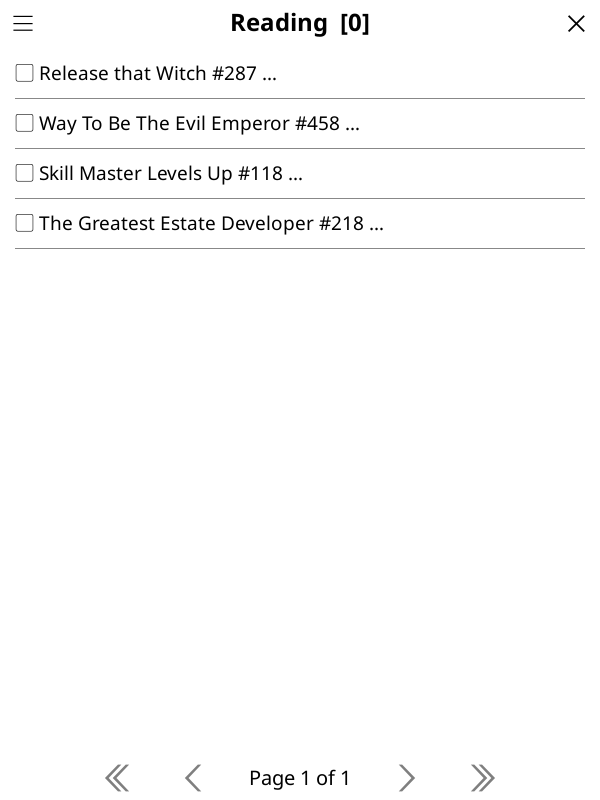
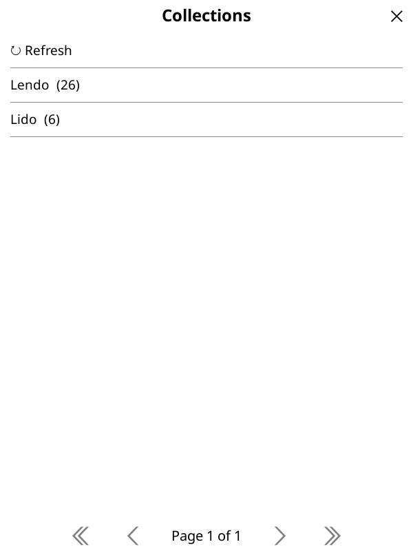

# Usage

## Browse

Open **Komga → Browse & download** (under the **Tools** menu). The home hub offers six modes:

- **Current Reading** — chapters you've partially read, across all series.
- **Deck** — the next-to-read chapter of each series you've started ("on deck").
- **Last Updated** — the most recently added chapters (first 200).
- **Last Added Series** — the most recently added series (first 200).
- **Collections** — your Komga collections; open one to see its series.
- **All** — every series; the first row is **Search** to filter by name.

The chapter modes open a chapter list directly; the series modes open a series list, and
tapping a series opens its chapters.

{ width="320" }

### Collections

Opening **Collections** lists your Komga collections; tapping one scopes the series list to
that collection.

{ width="320" }

## Chapter selection

Each row shows a checkbox, the series title, the chapter number, and a status marker:

| Marker | Meaning |
|--------|---------|
| `▢` / `✓` | unchecked / checked (selected) |
| `✔` | read |
| `…` | in progress |
| `⤓` | the file is already on the device |

- Tap a chapter to toggle its checkbox (the list stays on the current page).
- Tap the **menu icon** in the title bar (visible on every page) to open the actions popup:
    - **Select unread** — select all chapters you haven't finished.
    - **Next N unread…** (single-series lists only) — select the next N unread after your last-read chapter.
    - **Select all** / **Clear** — select or deselect everything.
    - **⬇ Download** — download the selected chapters (the button shows the count).
    - **↻ Refresh** — reload the list from the server.

## Downloads

- Downloads run with a progress popup; tap it to **stop between chapters** (cancellation is
  not mid-chapter).
- Files that already exist are skipped.
- A summary shows downloaded / skipped / failed counts and the destination folder.

## Where files go

```
<download root>/Komga/<Series name>/<NNNN>.cbz
```

- The **download root** resolves to the first available of: a custom `download_dir` setting,
  your file-manager **home** directory, the device home (e.g. `/mnt/onboard` on Kobo), or the
  KOReader data dir — preferring a **public, user-visible** location.
- Series folder names are sanitized for FAT32 compatibility (illegal characters replaced with
  spaces, trailing dots removed).
- Chapters are named by zero-padded sort order (e.g. `0001.cbz`, `0010.cbz`, `0010.5.cbz`).
  If two chapters would map to the same name (duplicate/missing sort), later ones get a short
  id suffix (e.g. `0001_<id>.cbz`).
- Configurable via the `download_dir` setting in the KOReader settings file.

## Read-progress sync

Works automatically if your KOReader↔Komga sync is set up:

- The Komga user needs the `KOREADER_SYNC` role.
- The library must have "Compute hash for files for KOReader" enabled.
- KOReader's document matching must be set to "Binary".

No extra steps in this plugin — use KOReader's built-in sync.

## Known limitations

- **No download resume**: a failed or cancelled chapter is re-downloaded from scratch;
  partial files are removed.
- **Cancellation between chapters only**: stopping happens after the current chapter
  completes, not mid-download.
- **Plaintext credentials**: stored in KOReader settings without encryption (a KOReader limitation).
- **Recency caps**: "Last Updated" and "Last Added Series" show the first 200 items only.
